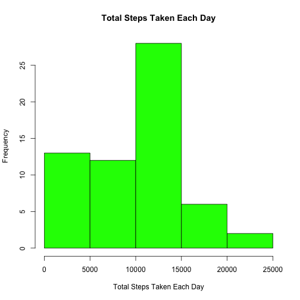
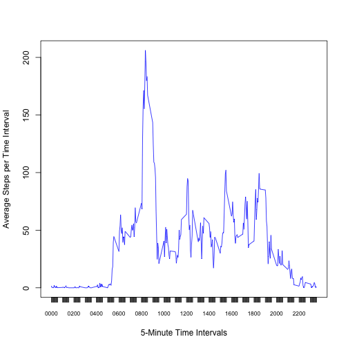
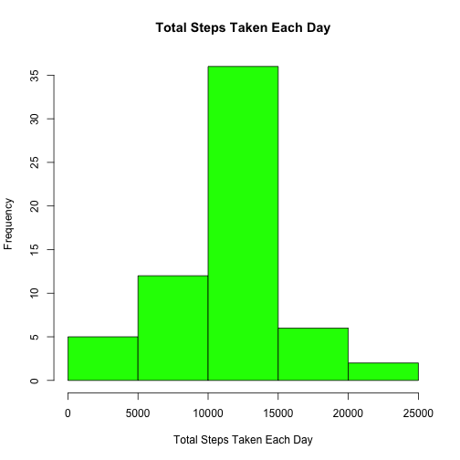
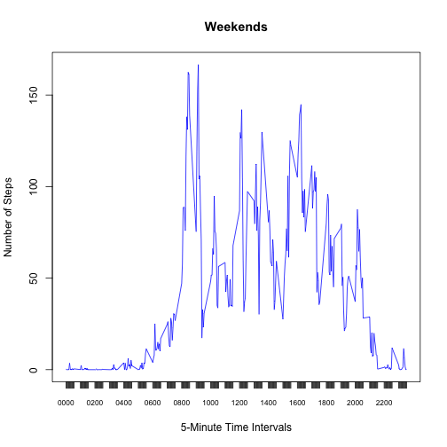
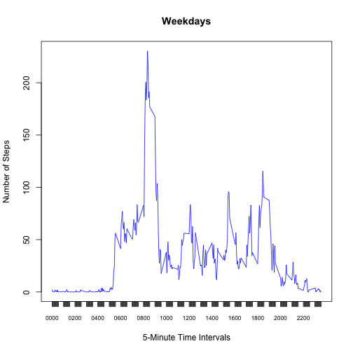

# Reproducible Research: Peer Assessment 1


## Loading and preprocessing the data

1. Load the data.

```r
library(plyr)
activity <- read.csv('activity.csv')
```

2. Process/transform the data (if necessary) into a format suitable for your analysis.


```r
stepsbydate <- ddply(activity, .(date), summarize, total=sum(steps,na.rm=TRUE))
stepsbyinterval <- ddply(activity, .(interval), summarize, total=sum(steps,na.rm=TRUE), mean=mean(steps,na.rm=TRUE), median=median(steps,na.rm=TRUE))
# stepsbyinterval$interval <- sprintf("%04d",stepsbyinterval$interval)
```

## What is mean total number of steps taken per day?

1. Make a histogram of the total number of steps taken each day.

```r
hist(stepsbydate$total, main="Total Steps Taken Each Day", xlab="Total Steps Taken Each Day",col="green")
```

 

2. Calculate and report the mean and median total number of steps taken per day.

```r
meansteps <- mean(stepsbydate$total,na.rm=TRUE)
mediansteps <- median(stepsbydate$total, na.rm=TRUE)
```
Mean steps per day is 9354.  
Median steps per day is 10395.

## What is the average daily activity pattern?

1. Make a time series plot (i.e. type = "l") of the 5-minute interval (x-axis) and the average number of steps taken, averaged across all days (y-axis).

```r
# Customize x-axis; suppress plot x axis and replace with own values
plot(stepsbyinterval$interval, stepsbyinterval$mean, type="l", col="blue", xlab="5-Minute Time Intervals",xaxt="n", ylab="Average Steps per Time Interval")
axis(1,at=x<-stepsbyinterval$interval,labels=sprintf("%04d",x), cex.axis=0.7)
```

 

```r
# axis(1,at=x<-stepsbyinterval$interval,labels=as.character(x), cex.axis=0.7)
```

2. Which 5-minute interval, on average across all the days in the dataset, contains the maximum number of steps?


```r
intervalwithmaxsteps <- stepsbyinterval[which(stepsbyinterval$mean==max(stepsbyinterval$mean)),]$interval
maximumsteps <- max(stepsbyinterval$mean)
```
The 5-minute interval that contains the maximum number of average steps is 835 with 206.1698 steps.

## Imputing missing values

1. Calculate and report the total number of missing values in the dataset (i.e. the total number of rows with NAs)


```r
rowswithna <- activity[!complete.cases(activity),]
```
The total number of rows with NAs in the data set is *2304*.

2. Devise a strategy for filling in all of the missing values in the dataset. The strategy does not need to be sophisticated. For example, you could use the mean/median for that day, or the mean for that 5-minute interval, etc.

_I shall use the mean for the 5 minute interval to replace the NA values._

3. Create a new dataset that is equal to the original dataset but with the missing data filled in.


```r
# create another dataset activity2 from activity. merge with dataset containing average (mean) steps per interval, then replace NA step values with the mean.
activity2 <- activity
activity2 <- merge(activity2,stepsbyinterval,by.x="interval",sort=FALSE)
# Sort by date and interval
activity2<-activity2[with(activity2, order(date,interval)),]
activity2[!complete.cases(activity2),]$steps <- activity2[!complete.cases(activity2),]$mean
# Remove mean and median columns as they are no longer needed
activity2<-activity2[,c("steps","date","interval","total")]
```


Calculating total number of steps taken each day and calculating mean and median steps per day based on the new data set.

```r
stepsbydate2 <- ddply(activity2, .(date), summarize, total=sum(steps,na.rm=TRUE))
```
4. Make a histogram of the total number of steps taken each day and Calculate and report the mean and median total number of steps taken per day. Do these values differ from the estimates from the first part of the assignment? What is the impact of imputing missing data on the estimates of the total daily number of steps?


```r
hist(stepsbydate2$total, main="Total Steps Taken Each Day", xlab="Total Steps Taken Each Day",col="green")
```

 

```r
#meansteps2 <- mean(stepsbydate2$total,na.rm=TRUE)
#mediansteps2 <- median(stepsbydate2$total, na.rm=TRUE)
meansteps2 <- mean(stepsbydate2$total)
mediansteps2 <- median(stepsbydate2$total)
```
New mean steps per day is 10766. Value in first step was 9354.2295 (difference is 1411.9592.    
New median steps per day is 10766. Value in first step was 10395 (difference is 371).

## Are there differences in activity patterns between weekdays and weekends?

1. Create a new factor variable in the dataset with two levels – “weekday” and “weekend” indicating whether a given date is a weekday or weekend day.


```r
# Custom function to determine if a day is a weekend or not.
is.weekend <- function(x){
        x %in% c("Saturday","Sunday")
}

activity2$weekend <- is.weekend(weekdays(as.Date(activity2$date)))
activity2$weekday <- !is.weekend(weekdays(as.Date(activity2$date)))
```

2. Make a panel plot containing a time series plot (i.e. type = "l") of the 5-minute interval (x-axis) and the average number of steps taken, averaged across all weekday days or weekend days (y-axis).


```r
stepsbyintervalWeekend <- ddply(activity2[activity2$weekend==TRUE,], .(interval), summarize, total=sum(steps,na.rm=TRUE), mean=mean(steps,na.rm=TRUE), median=median(steps,na.rm=TRUE))

stepsbyintervalWeekday <- ddply(activity2[activity2$weekday==TRUE,], .(interval), summarize, total=sum(steps,na.rm=TRUE), mean=mean(steps,na.rm=TRUE), median=median(steps,na.rm=TRUE))

plot(stepsbyintervalWeekend$interval, stepsbyintervalWeekend$mean, type="l", main="Weekends", col="blue", xlab="5-Minute Time Intervals",xaxt="n", ylab="Number of Steps")
axis(1,at=x<-stepsbyinterval$interval,labels=sprintf("%04d",x), cex.axis=0.7)
```

 

```r
plot(stepsbyintervalWeekday$interval, stepsbyintervalWeekday$mean, type="l", main="Weekdays", col="blue", xlab="5-Minute Time Intervals",xaxt="n", ylab="Number of Steps")
axis(1,at=x<-stepsbyinterval$interval,labels=sprintf("%04d",x), cex.axis=0.7)
```

 
